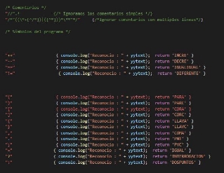
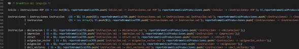
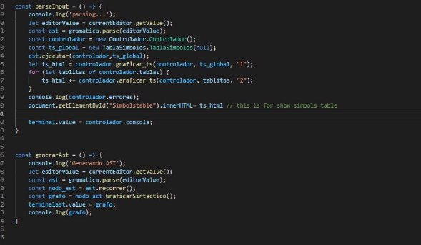
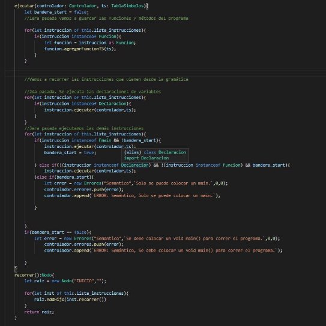
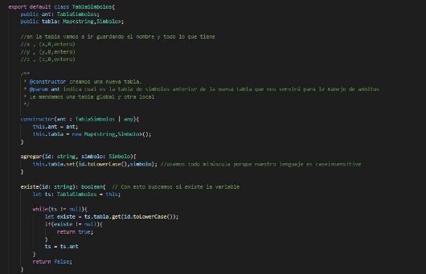
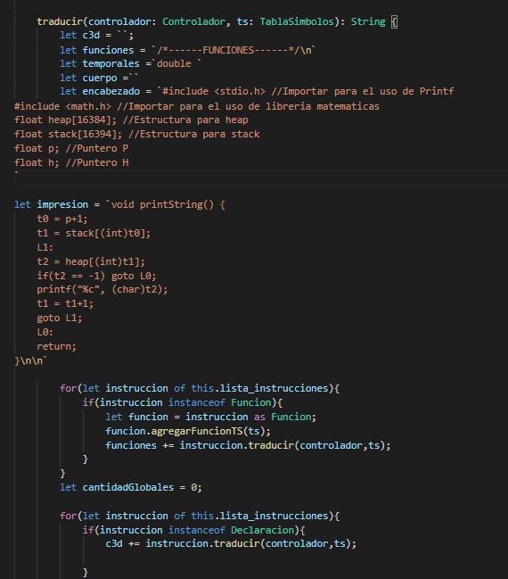
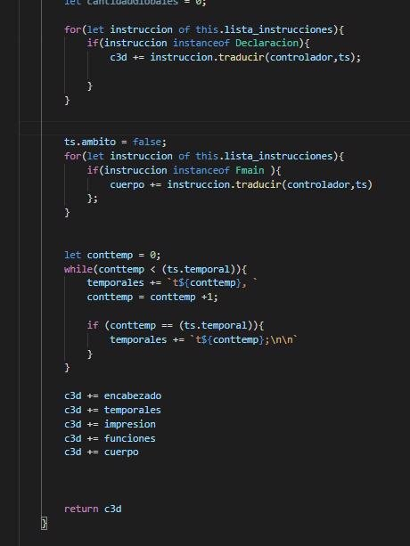
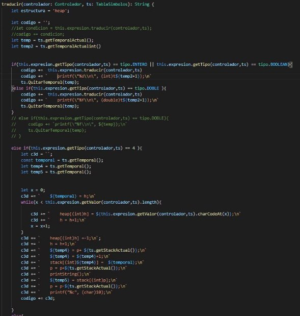

**MANUAL TECNICO (Quetzal)** 

Quetzal es un lenguaje de programación inspirado en C, su característica principal es  la  inclusión  de  tipos  implícitos.  El  sistema  de  tipos  de  Quetzal  realiza  una formalización de los tipos de C y Java. Esto permite a los desarrolladores definir variables y funciones tipadas sin perder la esencia. Otra inclusión importante de Quetzal es la simplificación de los lenguajes C y Java para poder realizar diferentes instrucciones en menos pasos. 

El intérprete fue hecho con la herramienta Jison. Para instarlo debemos usar el siguiente comando  

*Npm install jison –g* 

La estructura del archivo gramatica.jison es la siguiente: 

Aquí agregamos todas las opciones que deseamos en el interprete 

Luego de agregar las definiciones léxicas empezamos a declarar nuestras expresiones regulares. 

Aquí declaramos los símbolos del programa, colocando las palabras reservadas, comentarios, espacios en blanco, todos los símbolos de expresiones regulares, etc 

Despues del símbolo lex agregamos el área de imports, donde importamos las clases que vamos a utilizar para que la gramática tengan funcionalidad, se debe declarar como constante 

Luego se define la asociatividad y precedencias de los operadores si la gramática es ambigua, se agrega de menor a mayor. 

` `Seguido de eso le indicamos cual será nuestro símbolo inicial. 

Es la última, parte de la gramatica donde cada producción incluye el código de javascript entre llaves {código\_js}, la variable $$ puede tomar cualquier valor. 

**Para poder iniciar el flujo de nuestro programa se creó el archivo editor.js**  

**La función parseInput es la que inicializa nuestro ast, controlador y llena la tabla de símbolos global, la función generarAst recorre el árbol para poder hacer el reporte en graphviz** 

**Para poder manipular los textarea del html se declararon de la siguiente manera**  

**Para mostrarlo en el html se usó esta línea para concatenar el editor.js con el index.html** 

**Se creó una clase AST para manipular el flujo de nuestro programa que tiene 3 pasadas, en la primera se guardan las funciones y métodos, la segunda ejecuta las declaraciones y por último se ejecutan todas las otras** 

**SE creó la clase expresión la cual contiene dos métodos, getTipo para que nos devuelva el valor de la expresión y getValor para que nos devuelva el valor de la expresión** 

**SE creó la clase Instrucción la cual contiene un método. Ejecutar, la clase expresión y la clase instrucción indican que hacer con cada clase que extienda de estas.** 

**Se crearon varias clases por cada operación que admite el programa, todas estas extienden de Expresión** 

**Se crearon varias clases para cada instrucción, estas extienden de instrucción** 

**Se crearon varias clases para las sentencias cíclicas, extienden de instrucción** 

**Se crearon varias clases para las sentencias de control, extienden de instrucción** 

**Se crearon varias clases para las sentencias de control, extienden de instrucción** 

**Para manejar la tabla de símbolo se creo una clase símbolo. Y en la clase tabla de símbolos se crearon métodos (agregar,existe,getsimbolo,existenactual) para manipular los datos:** 

**La función agregar, agrega el símbolo a la tabla de símbolos para poder usarlo en cualquier momento que se requiera** 

**La función existe verifica si existe el id, buscando en la tabla de símbolos la variable, si la encuentra devuelve true y si no devuelve false** 

**La función getSimbolo obtiene el símbolo asociado al id, que contiene toda la información de este.** 

**La función existenActual verifica si existe el id, buscando en la tabla de símbolos local la variable, si la encuentra devuelve true y si no devuelve false.** 

**TRADUCCION 3D** 

**Se implementó la función traducir en el AST la cual inicializa el código 3d concatenando en nuestra variable c3d todo el código traducido.**  

**En la primera pasada traduce funciones, luego declaraciones y por último todo lo que se encuentra en el main** 

**Al final del método concatenamos el encabezado, la lista de temporales, el método de impresión, funciones y por último todas las instrucciones en el main** 

**Para la traducción de un println verificamos primero si es de tipo entero o booleano, si es uno de ellos, traducimos la expresión y luego la imprimimos con %d, si es de tipo double la imprimimos con %f y si es de tipo cadena usamos temporales para guardar sus valores char en el heap.** 

**Concatenamos todo al c3d y retornamos ese string.** 
10 
