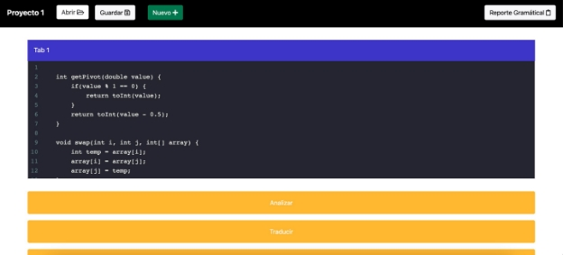
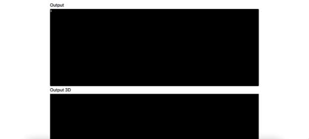
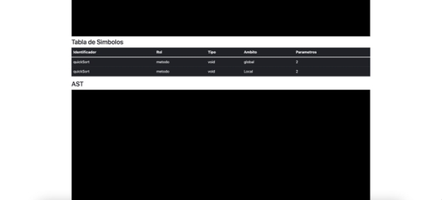
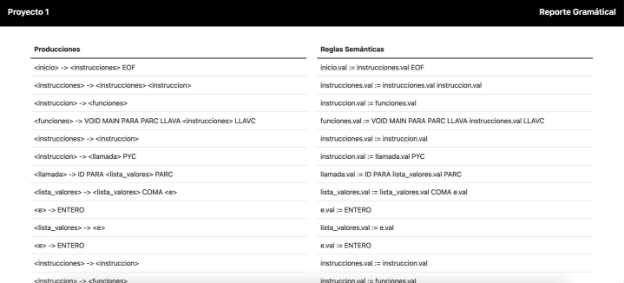

**Manual de Usuario**

OCL1 - Proyecto 1

Quetzal es un lenguaje de programación inspirado en C, su característica principal es la inclusión de tipos implícitos. El sistema de tipos de Quetzal realiza una formalización de los tipos de C y Java. Esto permite a los desarrolladores definir variables y funciones tipadas sin perder la esencia. Otra inclusión importante de Quetzal es la simplificación de los lenguajes C y Java para poder realizar diferentes instrucciones en menos pasos.

Para ello, se realizó una aplicación web amigable para el usuario final. La aplicación cuenta con los siguientes features:

- Consola con numero de línea y columna
- Botón para interpretar 
- Botón para traducir 
- Reporte de errores
- Reporte de tabla de símbolos
- Reporte de AST 
- Reporte Gramatical 
- Salida del Código Intermedio (C3D)

` `A continuación se detalla el uso de la aplicación.

La aplicación cuenta con una pantalla para las funcionalidades principales de la herramienta y una página secundaria que nos mostrará el reporte gramátical que más adelante se detalla.

Se cuentan con tres botones, el primero para analizar, posteriormente para traducir y por último el botón que realiza la generación del AST.

Cuando se haga scroll para abajo, se observa la consola de salida (Output), cuya salida es el resultado de la interpretación de la entreda o los errores presentados, en caso haber.

En la consola apartada para traducción, se presenta el código intermedio generado. En la tabla de simbolos el detalle de los simbolos obtenidos durante la ejecución del programa.

En el apartado de AST, se mostrará el texto que define la estructura gráfica del análisis de la entrada. Este es un .dot, el cual podrá ser visto gráficamente mediante un compilador de Graphviz.

En la página de Reporte Gramátical, se mostrará el recorrido de la gramática (producciones) y el recorrido con las reglas semánticas aplicadas, el cual hace referencia a su traducción dirigida por la sintáxis.
Manual de Usuario 4
